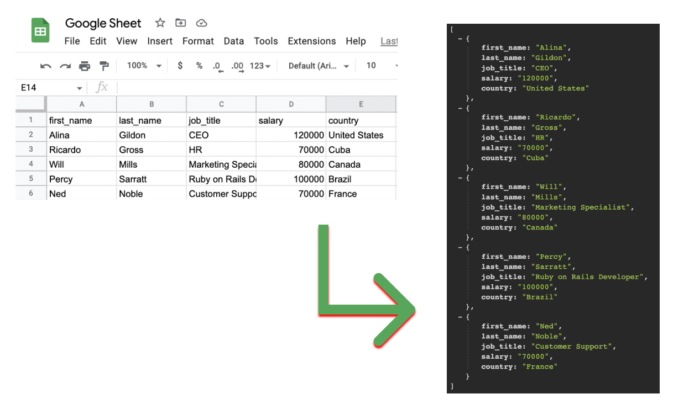

# How to get data from Google Sheet using Ruby on Rails?



This method will help you to download data from Google Sheet as CSV to Rails public folder (or any other folder) and parse it as array of hashes.

This is pure Ruby on Rails implementation. No gems. Just a [single file](https://github.com/AndreyAzimov/ruby-on-rails-google-sheet-csv/blob/main/google_sheet.rb).

Data in the Google Sheet is updating live automatically.

It was on Heroku as well.

## Prepare your Google Sheet
1. Open your Google Sheet e.g. [this one](https://docs.google.com/spreadsheets/d/1A4ad-FM0SR-LiCRN301w-WnW-H7wFg2BJ7QMLsGJxqw/edit?usp=sharing)
2. File -> Share -> Publish to the web
3. Entire Document -> Sheet1
4. Web page -> Comma-separated values (.csv)
5. Share
6. Copy the url that should look like this: [https://docs.google.com/spreadsheets/d/e/2PACX-1vSf0VkQ9iCihfZqlNDg04GTso_seU8Pom53YtPjGc6PrUlJ1bY9b6WHARo2MQFJnLbrt4P7-PlnNm4_/pub?gid=0&single=true&output=csv](https://docs.google.com/spreadsheets/d/e/2PACX-1vSf0VkQ9iCihfZqlNDg04GTso_seU8Pom53YtPjGc6PrUlJ1bY9b6WHARo2MQFJnLbrt4P7-PlnNm4_/pub?gid=0&single=true&output=csv)

## Usage
- Copy [google_sheet.rb](https://github.com/AndreyAzimov/ruby-on-rails-google-sheet-csv/blob/main/google_sheet.rb) file to `/app/models/` (if you are using Rails)
- Usage:

```
url = "https://docs.google.com/spreadsheets/d/e/2PACX-1vSf0VkQ9iCihfZqlNDg04GTso_seU8Pom53YtPjGc6PrUlJ1bY9b6WHARo2MQFJnLbrt4P7-PlnNm4_/pub?gid=0&single=true&output=csv"
data = GoogleSheet.get url
```
## Options:
- If you are not using Ruby on Rails change csv file path to your: ```csv_file = "#{Rails.root}/public/data.csv"```
- if your CSV doesn't have headers change `headers: false`
